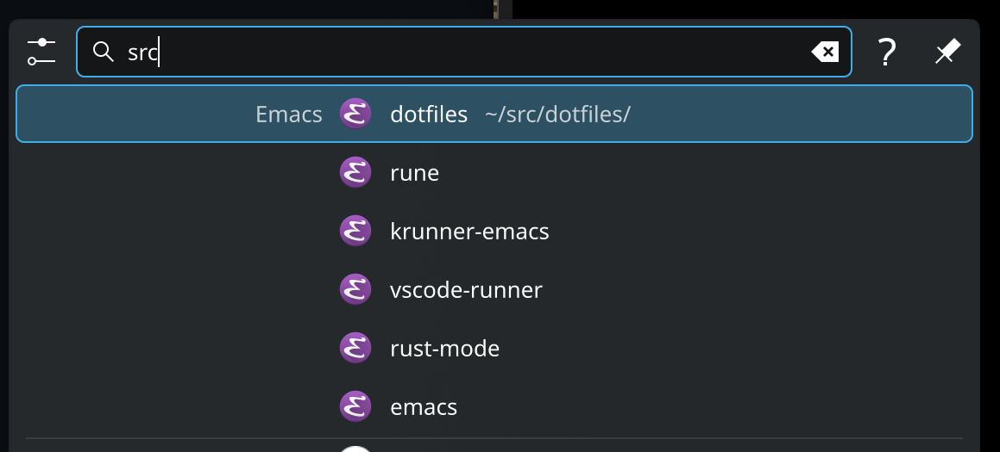

A krunner plugin that lists Emacs projects (project.el)

 

## Screenshot

 

## Requirements

- Emacs in path

## Configuration

There is not configuration, but the plugin works by running `emacs -Q ...` to provide D-Bus service, so if you have changed `project-list-file` from the default value you may want to create a symlink at `~/.emacs.d/projects` so Emacs without your config can find the project list file.
